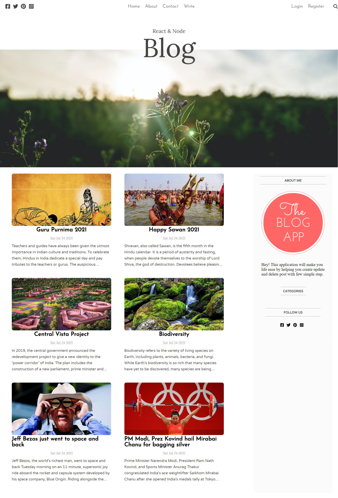
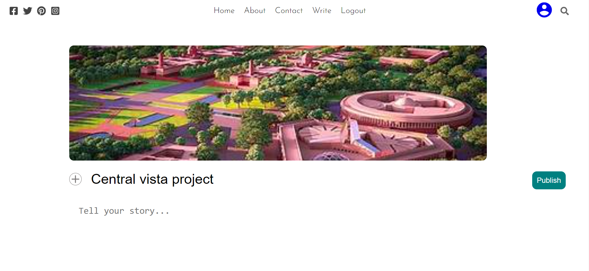

# blog_application
**MERN STACK APP**

#### Intro
A blog application help to create, update, delete and read own blog as well as blog created by other users. Appication front end is styled using ReactJS(Context). Backend powered by express server and mongoDB as database.
Username/password based authentication and JWT for authorization. Multer to store data into server folder

#### Project Description

1. Client
  - Blog App UI as client
  - Context Api for component state mangement
  - Allow to create update delete post and update user accounts to a authorized user
  - App contain a following pages
    1. Home
    2. Login
    3. Register
    4. Setting
    5. SinglePost
    4. Write
2. Server
  - Express server handle a route from front end and perform a CURD operation on database
  - Authorized user can access the all the route
  - Multer to store the data(img) at server
  
  ### Step to get the development server
  1. Clone the repo
  2. `cd client` and `npm install` to get all dependency at client side
  3.  `npm start` to lauch the client app
  4. `cd server` and `npm install` to get all dependency at server side
  5. server folder must contain a *.env* file with envirnment variable (PORT, MONGODB_URL, DATABASE, ACCESSS_TOKEN, REFRESH_TOKEN)
  6. `npm start` to lauch the server app
  
  #### Glance of blog app
  
  1. Home Page
  
  
  
  2. Write page
  
  
  
